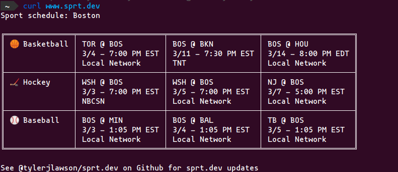

# sprt.dev :basketball: :baseball: :ice_hockey: :football:

This project aims to provide you with the upcoming games near your location without ever needing to leave your terminal.

## Usage Instructions

Run

```
curl https://sprt.dev
```

[Or visit the site here](https://sprt.dev)

If you would like to search for a city or place other than your current location simply search for the city like this request for boston. Anything you type after the `/` will be searched for a location to find teams near.



## Team Selection Strategy

For this app we are currently supporting the four major US professional sports: basketball, baseball, hockey, & football. When using your current location or a location that you have searched for we will show the schedule for the sports that are closest geographically to you and also currently have upcoming scheduled games (in-season sports). When there is a city that has multiple teams in the same sport, we go ahead and give you the schedule for both teams.


## Progress Plan / Ideas

I would like to build this application out to support more teams, sports, or general flexibility. All ideas are welcome as issues or Pull Requests!

## Dev Setup Instructions

```
npm i -g yarn # if you do not already have yarn
yarn install
yarn dev # see package.json for other scripts
```
